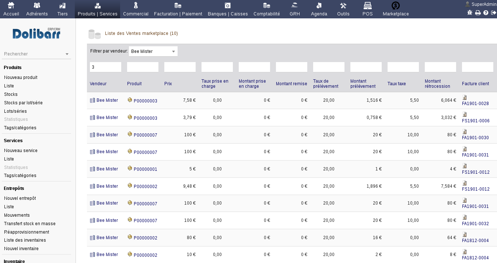
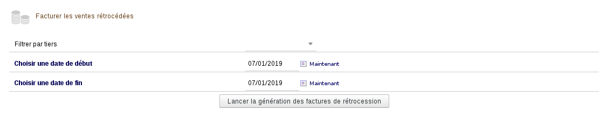

.. _rst_sales:

Gestion des ventes
========================================

.. toctree::
   :maxdepth: 2
   :caption: Contents:

Enregistrement des ventes / reversement
#####################################

Chaque vente est enregistrée après paiement d'une facture, grâce aux triggers de Dolibarr ERP/CRM : on calcule le montant de reversement en trouvant le vendeur du produit et son taux de prélèvement.

La formule pour le calcul du montant à reverser est la suivante :

.. code-block:: none

   prix de base HT = (prix produit * quantité)
   prix de base HT  - ( prix de base HT * ( taux prélèvement / 100)).

La formule pour le calul du montant à prélever est la suivante :

.. code-block:: none

   total HT de la ligne - montant à reverser (- montant pris en charge vendeur)

Liste des ventes
####################################

Pour chaque facture payée dans Dolibarr, le montant de la vente, le taux de rétrocession et le montant à rétrocéder sont listés sur l'écran accessible depuis le menu *Facturation/paiement -> Liste des ventes fournisseurs*.

Pour chaque ligne de facture cette liste affiche :

 Vendeur
   Le tiers (fournisseur) qui a fait la vente

 Produit
   Le produit vendu

 Prix
   Le prix de vente

 Taux de prise en charge
   …

 Montant pris en charge
   Montant pris en charge par le vendeur

 Montant remise
   Remise en pourcentage, effectuée sur la ligne

 Taux de prélèvement
   Le taux de prélèvement appliqué à la vente (en pourcentage)

 Montant prélèvement
   Montant du prélèvement

 Taux taxe
   Le taux de taxe appliqué à la ligne

 Montant rétro-cession
   Montant à verser au vendeur, après déduction de la commission

 Facture client
   Facture correspondante au client final

 Facture vendeur
   Facture du vendeur  (un tiers fournisseur pour Dolibarr)

 État
   Statut de la vente : non comptée, facturée ou payée

Facturation des ventes
#####################################

Les montants des ventes à rétrocéder sont facturés à l'aide des factures fournisseurs de Dolibarr ERP/CRM. 

Le module fourni un modéle spécifique pour la **facturation « pour le compte de tiers »**.

Un formulaire, accessible depuis le menu *Facturation / paiement -> Rétrocession -> facturer les ventes fournisseur*, permet de sélectionner la période des ventes à rétrocéder et éventuellement filtrer par un fournisseur. 

		
Après un clic sur le bouton *Lancer la génération des factures* va déclencher le traitement suivant :

- regroupement des ventes à facturer par fournisseur dans la période sélectionnée
- pour chaque fournisseur :

  - création d'une facture avec décompte de chiffres d'affaires et une ligne négative pour les commissions.
  - changement du statut de la vente : de **À facturer** à **Attente règlement**
  - validation de la facture
  - envoi de la facture par mail (à venir)

Suivi des paiements
#####################################

Lorsqu'un paiement est émis il doit être saisi sur la facture fournisseur. 

Une fois que la facture fournisseur est marquée comme payée, la vente passe du statut **Attente réglement** au statut **Payé**.

Modification d'une vente
####################################

Chaque vente peut être modifiée en cliquant sur l'icône «stylo» en bout de chaque ligne de la liste des ventes.

.. DANGER::
    **Attention** : l'édition des valeurs ne provoquera pas le recalcul des commissions, il faut saisir les bonnes données à calculer au préalable.